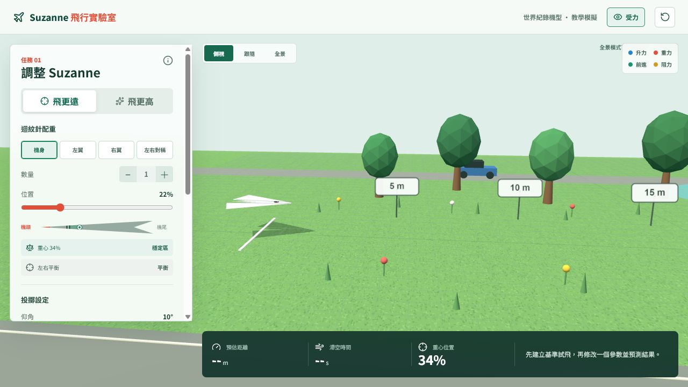
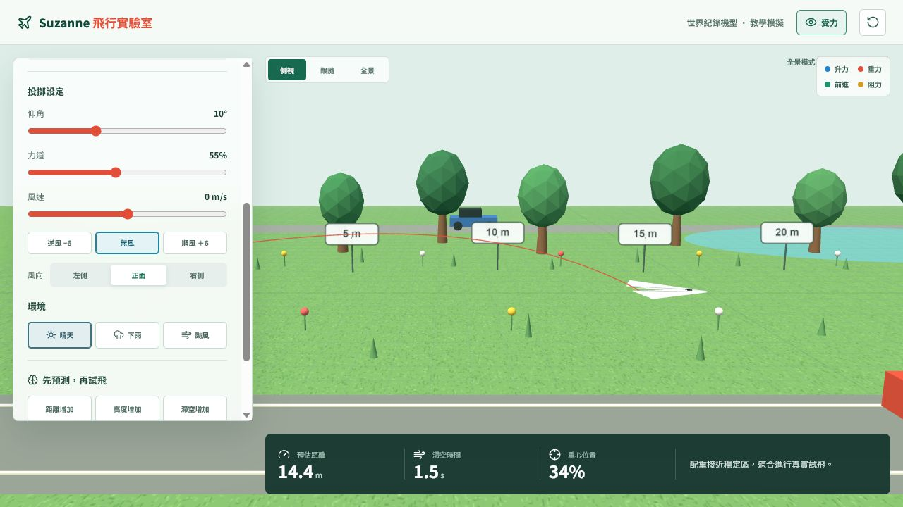

# Suzanne 紙飛機飛行實驗室

一個為國小課堂設計的互動式紙飛機飛行模擬器。學生可以調整 Suzanne 紙飛機的迴紋針配重、投擲角度、力道、風向與天氣，觀察飛行距離、高度、滯空時間和側偏變化。



## 功能

- Suzanne 紙飛機 3D 模型與平滑飛行動畫
- 機身、左翼、右翼及左右對稱迴紋針配重
- 距離、高度、滯空時間、重心與側偏估算
- 正面風、左側風與右側風控制
- 晴天、下雨與颱風環境
- 颱風亂流、斜向暴雨、風粒子與樹木搖晃
- 側視、跟隨與全景觀看模式
- 慢動作重播與飛行關鍵事件提示
- 適合手機、平板及桌面電腦的響應式介面



## 技術

- React 19
- Vite 7
- Three.js
- Lucide React

## 本機執行

需要 Node.js 20 或更新版本。

```bash
npm install
npm run dev
```

開啟終端機顯示的本機網址即可使用。

## 正式建置

```bash
npm run build
```

輸出檔案位於 `dist/`。專案使用相對資源路徑，因此可將 `dist` 內容部署到 XAMPP 的子資料夾，例如：

```text
C:\xampp\htdocs\paperplane\
```

## 課堂用途

建議讓學生先建立基準試飛，每次只調整一個變因，先預測結果再重新試飛，比較配重、風向與環境對飛行的影響。

## 授權

本專案採用 [MIT License](LICENSE)。
